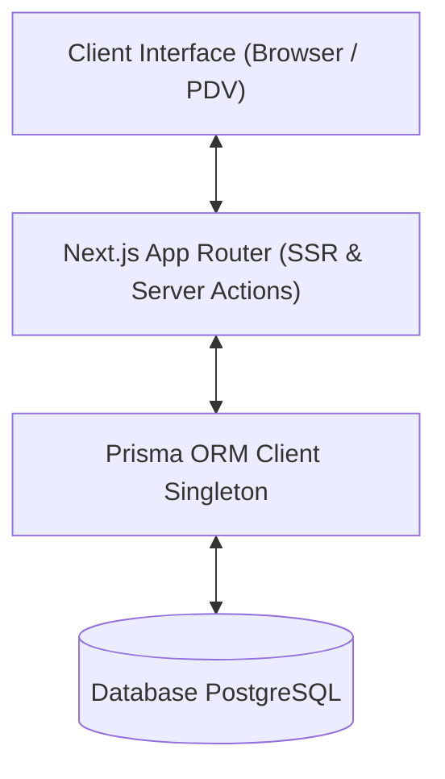
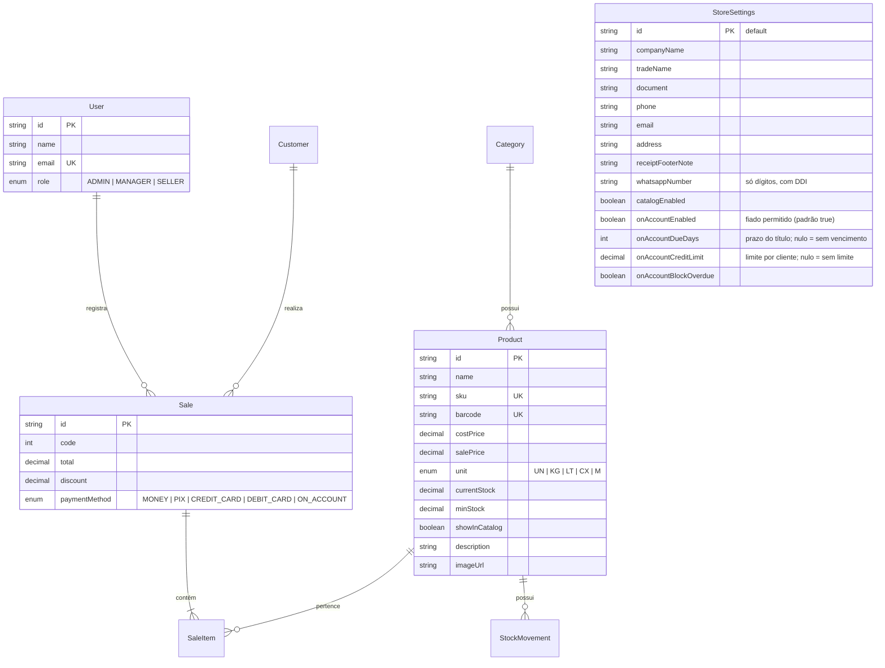

# 🏗️ Arquitetura do Sistema - Gestão de Lojas (ERP / PDV)

Este documento descreve a arquitetura técnica, modelo de dados e padrões de desenvolvimento adotados para guiar agentes de IA e desenvolvedores.

---

## 🧭 Visão Geral da Arquitetura

O sistema é construído como uma aplicação monolítica moderna utilizando **Next.js App Router**, combinando Server-Side Rendering (SSR), Server Components e Server Actions.



---

## 🗄️ Modelo de Dados (Prisma Schema)

O schema do banco de dados abrange as entidades fundamentais do sistema de gestão:



---

## 🧱 Padrões de Projeto (Design Patterns)

### 1. Singleton do Prisma Client (`src/lib/prisma.ts`)
Para evitar múltiplas conexões em ambiente de desenvolvimento durante o Hot Module Replacement (HMR) do Next.js.

### 2. Server Actions para Manipulação de Dados (`src/actions/`)
Toda a lógica de negócios e persistência deve ser encapsulada em Server Actions (`"use server"`), retornando objetos tipados padronizados:
```typescript
{ success: boolean; data?: T; error?: string }
```

### 3. Componentes da Interface (`src/components/`)
- **`src/components/ui/`**: Componentes puramente visuais e reutilizáveis do Shadcn UI.
- **`src/components/`**: Componentes de domínio (formulários, tabelas e visões específicas).

### 4. Catálogo público (`/catalogo`, issue #17)
Única área sem login além de `/login`. Liberada explicitamente em `src/auth.config.ts`.
- **Leitura pública:** funções de servidor em `src/lib/catalog.ts` (não são Server Actions). Os `select` trazem só campos de vitrine; o saldo vira apenas "Disponível"/"Indisponível" e custo e estoque mínimo nunca são lidos.
- **Pedido:** `POST /api/catalogo/pedido` (`src/lib/catalog-order.ts`) valida o carrinho, recalcula preços com `Prisma.Decimal`, exclui itens ocultos ou sem estoque e devolve a mensagem e a URL `wa.me`. Não grava nada no banco.
- **Carrinho:** `src/lib/catalog-cart.ts`, no `localStorage` do navegador; regras de unidade e quantidade compartilhadas em `src/lib/catalog-shared.ts`.
- **Painel:** produtos entram no catálogo por opt-in (`catalog.manage`); WhatsApp e liga/desliga ficam nas Configurações (`settings.manage`).

### 5. Venda no Fiado (issue #29)
Parâmetros em `StoreSettings`, editados nas Configurações (`settings.manage`) e lidos no servidor por `src/lib/on-account.ts`.
- **Venda:** `createSale` aplica as regras dentro da transação: fiado desligado recusa `ON_ACCOUNT`; com bloqueio de vencidos ou limite, trava a linha do cliente e recusa se houver título vencido não quitado ou se *saldo em aberto + venda* passar do limite. O prazo preenche `Receivable.dueDate` com 00:00 (fuso da loja) do dia da venda + N; o título fica vencido a partir do dia seguinte (`src/lib/store-time.ts`).
- **Menu:** `AppRoute.feature = "onAccount"` esconde "Contas a Receber" (e o card do Dashboard) só quando o fiado está desligado **e** não há títulos a receber. É só exibição: a página continua protegida por `receivables.view` e, pela URL, mostra um estado vazio informativo.

---

## 🧪 Boas Práticas & Validações

- **Execução do Build:** Sempre valide alterações executando `pnpm build`.
- **Regeneração de Tipos:** Execute `pnpm prisma generate` após qualquer modificação em `prisma/schema.prisma`.
- **Migrations:** Toda mudança de schema gera uma migration versionada em `prisma/migrations/` (`pnpm db:migrate --name <descricao>`). Em produção as migrations são aplicadas por passo explícito (`pnpm db:deploy`, conexão direta via `DIRECT_URL`), nunca no build. Ver `docs/DEPLOY.md`.
- **Primeiro administrador:** Criado por `src/lib/bootstrap-admin.ts` apenas quando o banco não tem usuários, a partir de `ADMIN_EMAIL` / `ADMIN_PASSWORD`. Não há credenciais fixas em produção.
- **Formatação de Código:** O projeto utiliza Prettier integrado ao Tailwind CSS para ordenação de classes.
