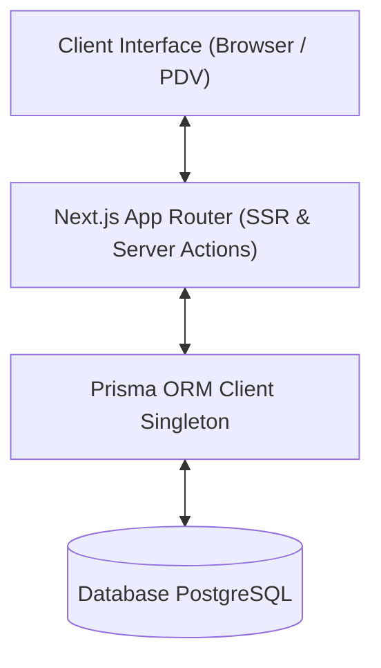
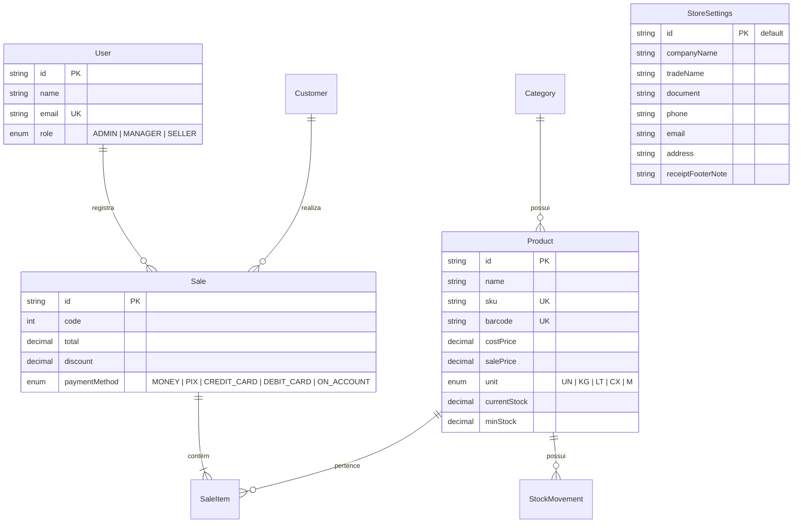

# 🏗️ Arquitetura do Sistema - Gestão de Lojas (ERP / PDV)

Este documento descreve a arquitetura técnica, modelo de dados e padrões de desenvolvimento adotados para guiar agentes de IA e desenvolvedores.

---

## 🧭 Visão Geral da Arquitetura

O sistema é construído como uma aplicação monolítica moderna utilizando **Next.js App Router**, combinando Server-Side Rendering (SSR), Server Components e Server Actions.



---

## 🗄️ Modelo de Dados (Prisma Schema)

O schema do banco de dados abrange as entidades fundamentais do sistema de gestão:



---

## 🧱 Padrões de Projeto (Design Patterns)

### 1. Singleton do Prisma Client (`src/lib/prisma.ts`)
Para evitar múltiplas conexões em ambiente de desenvolvimento durante o Hot Module Replacement (HMR) do Next.js.

### 2. Server Actions para Manipulação de Dados (`src/actions/`)
Toda a lógica de negócios e persistência deve ser encapsulada em Server Actions (`"use server"`), retornando objetos tipados padronizados:
```typescript
{ success: boolean; data?: T; error?: string }
```

### 3. Componentes da Interface (`src/components/`)
- **`src/components/ui/`**: Componentes puramente visuais e reutilizáveis do Shadcn UI.
- **`src/components/`**: Componentes de domínio (formulários, tabelas e visões específicas).

---

## 🧪 Boas Práticas & Validações

- **Execução do Build:** Sempre valide alterações executando `pnpm build`.
- **Regeneração de Tipos:** Execute `pnpm prisma generate` após qualquer modificação em `prisma/schema.prisma`.
- **Formatação de Código:** O projeto utiliza Prettier integrado ao Tailwind CSS para ordenação de classes.
