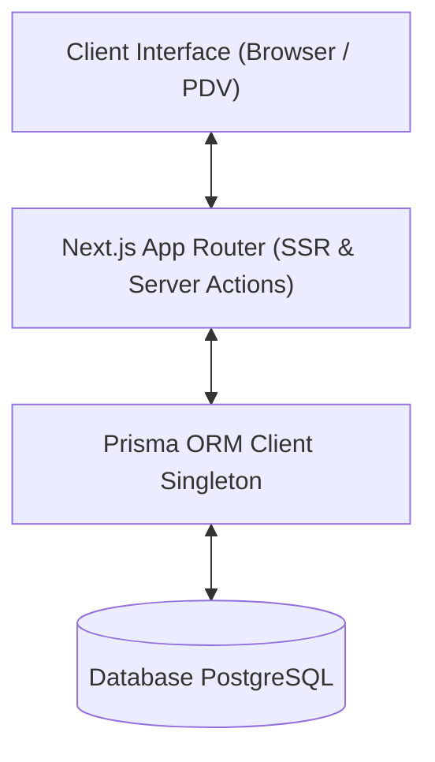
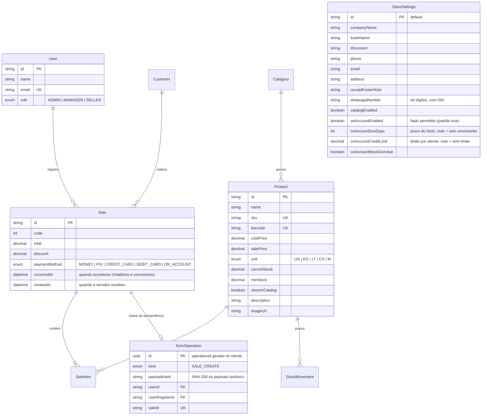

# 🏗️ Arquitetura do Sistema - Gestão de Lojas (ERP / PDV)

Este documento descreve a arquitetura técnica, modelo de dados e padrões de desenvolvimento adotados para guiar agentes de IA e desenvolvedores.

---

## 🧭 Visão Geral da Arquitetura

O sistema é construído como uma aplicação monolítica moderna utilizando **Next.js App Router**, combinando Server-Side Rendering (SSR), Server Components e Server Actions.



---

## 🗄️ Modelo de Dados (Prisma Schema)

O schema do banco de dados abrange as entidades fundamentais do sistema de gestão:



---

## 🧱 Padrões de Projeto (Design Patterns)

### 1. Singleton do Prisma Client (`src/lib/prisma.ts`)
Para evitar múltiplas conexões em ambiente de desenvolvimento durante o Hot Module Replacement (HMR) do Next.js.

### 2. Server Actions para Manipulação de Dados (`src/actions/`)
Toda a lógica de negócios e persistência deve ser encapsulada em Server Actions (`"use server"`), retornando objetos tipados padronizados:
```typescript
{ success: boolean; data?: T; error?: string }
```

### 3. Componentes da Interface (`src/components/`)
- **`src/components/ui/`**: Componentes puramente visuais e reutilizáveis do Shadcn UI.
- **`src/components/`**: Componentes de domínio (formulários, tabelas e visões específicas).

### 4. Catálogo público (`/catalogo`, issue #17)
Única área sem login além de `/login`. Liberada explicitamente em `src/auth.config.ts`.
- **Leitura pública:** funções de servidor em `src/lib/catalog.ts` (não são Server Actions). Os `select` trazem só campos de vitrine; o saldo vira apenas "Disponível"/"Indisponível" e custo e estoque mínimo nunca são lidos.
- **Pedido:** `POST /api/catalogo/pedido` (`src/lib/catalog-order.ts`) valida o carrinho, recalcula preços com `Prisma.Decimal`, exclui itens ocultos ou sem estoque e devolve a mensagem e a URL `wa.me`. Não grava nada no banco.
- **Carrinho:** `src/lib/catalog-cart.ts`, no `localStorage` do navegador; regras de unidade e quantidade compartilhadas em `src/lib/catalog-shared.ts`.
- **Painel:** produtos entram no catálogo por opt-in (`catalog.manage`); WhatsApp e liga/desliga ficam nas Configurações (`settings.manage`).

### 5. Venda no Fiado (issue #29)
Parâmetros em `StoreSettings`, editados nas Configurações (`settings.manage`) e lidos no servidor por `src/lib/on-account.ts`.
- **Venda:** a transação da venda (`registerSale`, em `src/lib/create-sale.ts`) aplica as regras: fiado desligado recusa `ON_ACCOUNT`; com bloqueio de vencidos ou limite, trava a linha do cliente e recusa se houver título vencido não quitado ou se *saldo em aberto + venda* passar do limite. O prazo preenche `Receivable.dueDate` com 00:00 (fuso da loja) do dia da venda + N; o título fica vencido a partir do dia seguinte (`src/lib/store-time.ts`).
- **Data:** o vencimento parte de `Sale.occurredAt` (dia em que a venda aconteceu), a mesma data usada nos relatórios e no dashboard.
- **Menu:** `AppRoute.feature = "onAccount"` esconde "Contas a Receber" (e o card do Dashboard) só quando o fiado está desligado **e** não há títulos a receber. É só exibição: a página continua protegida por `receivables.view` e, pela URL, mostra um estado vazio informativo.

### 6. Idempotência da venda (issue #35)
`createSale` (`src/actions/sales.ts`) só autoriza (`pdv.use`) e revalida as telas; as regras ficam em `registerSale` (`src/lib/create-sale.ts`), que a sincronização offline (#38) vai reaproveitar.
- **Chave:** o PDV gera um `operationId` (UUID, `src/lib/operation-id.ts`) por tentativa de finalização e o reaproveita enquanto o carrinho, o cliente e o pagamento não mudam.
- **Mesma transação:** a `SyncOperation` é gravada logo após travar o caixa e antes de qualquer efeito, junto com a venda, os itens, o estoque e o título. Mesma chave e mesmo hash devolvem a venda gravada; hash, operador ou tipo diferentes são recusados; rollback não deixa registro. A garantia é o índice único da chave (violação P2002 → devolve o resultado gravado), inclusive com chamadas simultâneas.
- **Caixa original:** a venda leva o id do caixa aberto quando o PDV carregou e trava esse caixa (`lockOwnOpenCashRegisterById`). Se ele foi fechado, a venda é recusada, nunca vai para o caixa aberto depois.
- **Datas:** `Sale.occurredAt` é quando a venda aconteceu e vale para relatórios, dashboard e vencimento do Fiado; `createdAt` é quando o servidor a recebeu. Na venda online as duas são iguais.

### 7. PDV que abre sem internet (issue #37)
Detalhes e decisões em `docs/OFFLINE.md` (seções 5, 6 e 7).
- **Service Worker:** Serwist (`src/service-worker/sw.ts`, servido em `/serwist/sw.js` pela rota `src/app/serwist/[path]/route.ts`). Guarda só os arquivos da versão (`_next/static`, `public/`) e as páginas estáticas `/pdv` e `/offline`; as demais navegações vão à rede e, sem conexão, mostram `/offline`. A versão nova espera o "Atualizar o app".
- **Tela:** `/pdv` (`src/app/pdv/page.tsx`) é estática e fora do `/admin`; o app (`src/components/offline-pdv/`) roda só no navegador e reaproveita o `PdvTerminal`. O `/admin/pdv` continua sendo o PDV online.
- **Dados no navegador:** Dexie (`src/lib/offline/db.ts`), um banco por operador e um banco comum com o aparelho. A comunicação usa os Route Handlers `GET /api/offline/ping`, `POST /api/offline/prepare` e `GET /api/offline/snapshot` (`src/lib/offline/sync.ts`).
- **Servidor:** `OfflineDevice` e `OfflineGrant` (autorização de 12 h vinculada ao caixa aberto), em `src/lib/offline-device.ts`.
- **Saída:** `signOutClearingOfflineData` (`src/lib/offline/sign-out.ts`) apaga a cópia local antes de encerrar a sessão; `OfflineUserGuard`, no layout do painel, apaga a cópia de outro operador.

---

## 🧪 Boas Práticas & Validações

- **Execução do Build:** Sempre valide alterações executando `pnpm build`.
- **Testes de integração:** `pnpm test:integration` (vitest, `tests/integration/`) roda contra um PostgreSQL real e descartável em `TEST_DATABASE_URL`; ver o README.
- **Regeneração de Tipos:** Execute `pnpm prisma generate` após qualquer modificação em `prisma/schema.prisma`.
- **Migrations:** Toda mudança de schema gera uma migration versionada em `prisma/migrations/` (`pnpm db:migrate --name <descricao>`). Em produção as migrations são aplicadas por passo explícito (`pnpm db:deploy`, conexão direta via `DIRECT_URL`), nunca no build. Ver `docs/DEPLOY.md`.
- **Primeiro administrador:** Criado por `src/lib/bootstrap-admin.ts` apenas quando o banco não tem usuários, a partir de `ADMIN_EMAIL` / `ADMIN_PASSWORD`. Não há credenciais fixas em produção.
- **Formatação de Código:** O projeto utiliza Prettier integrado ao Tailwind CSS para ordenação de classes.
